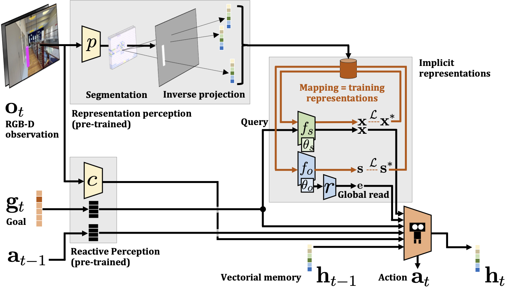

# Multi-Object Navigation with dynamically learned neural implicit representations
### [Project Page](https://pierremarza.github.io/projects/dynamic_implicit_representations/) | [Paper](https://arxiv.org/abs/2210.05129)

This codebase is based on a previous [repository](https://github.com/PierreMarza/teaching_agents_how_to_map) studying the impact of auxiliary losses on MultiON performance. With this released code, any user can thus experiment with our introduced implicit representations (see [paper](https://arxiv.org/abs/2210.05129)) and auxiliary losses from our [previous work](https://pierremarza.github.io/projects/teaching_agents_how_to_map/).

[Multi-Object Navigation with dynamically learned neural implicit representations](https://arxiv.org/abs/2210.05129)  
 [Pierre Marza](https://pierremarza.github.io/)<sup>1</sup>,
 [Laetitia Matignon](https://perso.liris.cnrs.fr/laetitia.matignon/)<sup>2</sup>,
 [Olivier Simonin](http://perso.citi-lab.fr/osimonin/)<sup>1</sup>,
 [Christian Wolf](https://chriswolfvision.github.io/www/)<sup>3</sup> <br>
 <sup>1</sup>INSA Lyon, <sup>2</sup>Université Lyon 1, <sup>3</sup>Naver Labs Europe <br>
in ICCV 2023



## Setup
Please follow the instructions in https://github.com/saimwani/multiON to install dependencies and download Matterport3D scenes.

## Data
### Episodes
Episodes are the same as in our [previous work](https://github.com/PierreMarza/teaching_agents_how_to_map). Download *train*, *val* and *test* episodes [here](https://drive.google.com/file/d/1ubfMKD7LPYaJWqz6MKjvBHDkcS3RuYyO/view?usp=share_link). The 3 folders should be copied to *data/datasets/multinav/3_ON/*. Please be careful! In the [original MultiON codebase](https://github.com/saimwani/multiON), what was called *val* set referred to the set of data used to perform final test of the model. We re-named their *val* set into *test* set, and introduced a proper validation set (*val*) to perform hyper-parameter search and early stopping.

### Pre-trained models
You can download all pre-trained models [here](https://drive.google.com/file/d/1H7Pf7FhZ6RF6MRRzPkfTQpeb8CcugNBl/view?usp=sharing). We provide a pre-trained global reader model (*global_reader.pth*), visual encoder and segmentation head for the Semantic Finder (*semantic_finder_visual_encoder.pth* and *semantic_finder_segmentation_head.pth*). Finally, we also release the weights of our SOTA agent (*policy.pth*) that was trained from scratch without any pre-training or training curriculum and with auxiliary losses, corresponding to row (k) in Table 2 in our [paper](https://arxiv.org/abs/2210.05129). In the paper, we report mean and std over different training runs (seeds). We chose the one with highest PPL performance on the validation (val) set.

## Agent training
### Implicit agent training
You can modify hyperparameters related to implicit representations in *habitat_baselines/config/multinav/ppo_multinav.yaml*. The two most important are: *learn_sem_finder* (*True*/*False*) to train a Semantic Finder in real time and use its outputs as input to the agent, and *learn_impl_net_expl_occ* (*True*/*False*) to train an Exploration and Occupancy Implicit Representation in real time. If *learn_impl_net_expl_occ* is *True*, *learn_sem_finder* must also be *True*. Having only *learn_sem_finder* as *True* and *learn_impl_net_expl_occ* as *False* will lead to faster training (as only one type of implicit representation is trained in real time). Once hyperparameters are set up, you can use the following command to train an agent using implicit representations,
```console
python habitat_baselines/run.py --exp-config habitat_baselines/config/multinav/ppo_multinav.yaml --agent-type implicit --run-type train
```

### Implicit agent training with auxiliary losses
As mentioned, training with auxiliary losses from our [previous work](https://pierremarza.github.io/projects/teaching_agents_how_to_map/) is also supported with this code. The following command shows you how to train an agent with implicit representations using the three auiliary losses (seen target, direction prediction, distance prediction) with the same coefficient (0.25) in the final loss,
```console
python habitat_baselines/run.py --exp-config habitat_baselines/config/multinav/ppo_multinav.yaml --agent-type implicit --run-type train --seen_coef 0.25 --dir_coef 0.25 --dist_coef 0.25
```

## Agent evaluation
To evaluate a model simply change the *--run-type* flag from *train* to *eval* and specify the path to either a specific checkpoint, or a folder containing a set of checkpoints (to evaluate all checkpoints in the folder) with the *--eval_path* flag: in the example below, we evaluate our released SOTA agent on the test set. You can modify the flag value to evaluate any other checkpoint you get after training a model. You can specify the set to evaluate on (*val* or *test*) with the *--eval_split* flag. Be careful not to use more processes than scenes (*val* and *test* respectively contain episodes from 11 and 18 scenes).

```console
python habitat_baselines/run.py --exp-config habitat_baselines/config/multinav/ppo_multinav.yaml --agent-type implicit --run-type eval --eval_path pretrained_models/policy.pth --eval_split test
```

## Citation
```
@inproceedings{marza2023_dynamic_impl_repr,
    author    = {Marza, Pierre and Matignon, Laetitia and Simonin, Olivier and Wolf, Christian},
    title     = {Multi-Object Navigation with Dynamically Learned Neural Implicit Representations},
    booktitle = {International Conference on Computer Vision (ICCV)},
    year      = {2023},
}
```
